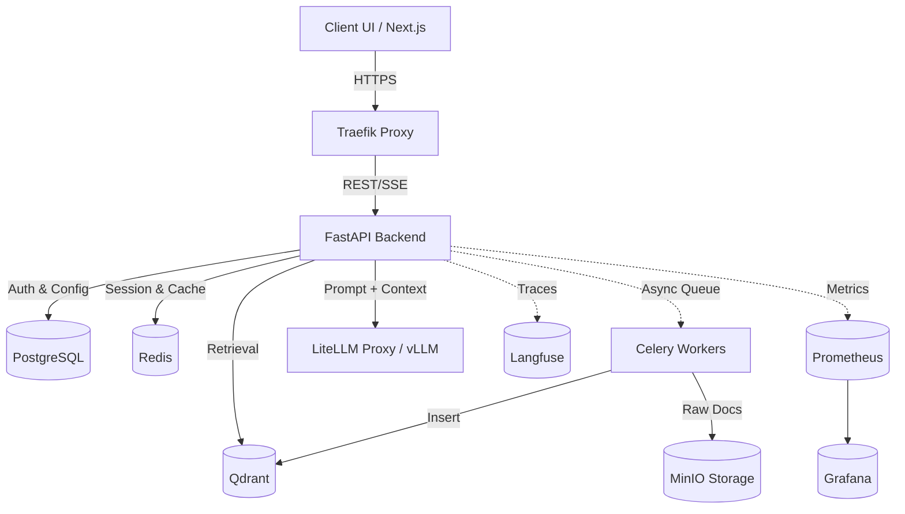

# OpenRAG 🚀

**The production-grade, 100% on-premise RAG platform built for enterprises that cannot compromise on data privacy.**

[](https://github.com/ardamoustafa1/OpenRAG/actions/workflows/ci.yml)
[](https://opensource.org/licenses/MIT)
[](https://www.python.org/downloads/)
[](https://hub.docker.com)
[](https://github.com/PyCQA/bandit)

> A highly secure, multi-tenant, completely on-premise Retrieval-Augmented Generation (RAG) platform. Designed for enterprises that require absolute data privacy, strict access controls, and robust observability — without a single byte leaving your infrastructure.

---

## 🌟 Key Features

| Feature | Description |
|---------|-------------|
| 🔒 **100% On-Premise** | No data leaves your infrastructure. Local LLMs via vLLM/Ollama and Qdrant vector storage. |
| 🏢 **True Multi-Tenancy** | Complete logical isolation of documents, vectors, users, and chat history per tenant. |
| 🛡️ **Enterprise Security** | RBAC, API Key management, JWT + TOTP MFA, SAML 2.0 / OIDC SSO, Audit Logging. |
| 🔍 **Hybrid Retrieval** | Dense vector search (Qdrant) + Sparse BM25, merged via Reciprocal Rank Fusion (RRF). |
| 📊 **Built-in Observability** | Native OpenTelemetry, Prometheus metrics, Grafana dashboards, Loki log aggregation, Langfuse LLM tracing. |
| ⚡ **Real-time Streaming** | SSE-based chat streaming with per-source citations grounded in your private knowledge base. |
| 🚀 **Production Ready** | Helm charts, Kubernetes HPA, Sealed Secrets, multi-arch Docker images, and automated Trivy scanning. |

---

## 📊 Why Choose This Over Alternatives?

| Feature | Enterprise RAG | Langflow / Dify | OpenAI Custom GPTs | Chainlit |
|---------|---------------|-----------------|--------------------|----|
| **Hosting** | 100% On-Premise ✅ | Cloud / On-Prem | Cloud Only ❌ | Self-hosted |
| **Data Privacy** | Absolute (Zero telemetry) | Depends on deployment | Owned by OpenAI ❌ | Partial |
| **Multi-Tenancy** | Native (Logical Isolation) ✅ | Workspaces | Workspaces | ❌ Single tenant |
| **RBAC / MFA** | Built-in ✅ | Limited | Enforced via SSO | ❌ Minimal |
| **LLM Support** | Any Local (vLLM, Ollama) ✅ | Any | OpenAI Only ❌ | Any |
| **Audit Logging** | Full async audit trail ✅ | Limited | Limited | ❌ None |
| **Kubernetes** | Native Helm + HPA ✅ | Limited | N/A | ❌ None |

---

## 🏗 Architecture Overview



For an in-depth look, see [ARCHITECTURE.md](docs/ARCHITECTURE.md).

---

## 🚀 Getting Started

### Prerequisites
- Docker & Docker Compose v2.x+
- Minimum 16GB RAM (32GB+ recommended if running local LLMs)
- NVIDIA GPU (Optional, but highly recommended for vLLM)

### Quick Start

```bash
# 1. Clone the repository
git clone https://github.com/ardamoustafa1/OpenRAG.git
cd OpenRAG

# 2. Setup environment variables
cp .env.example .env
# Edit .env — at minimum set SECRET_KEY, POSTGRES_PASSWORD, GRAFANA_ADMIN_PASSWORD,
# LANGFUSE_NEXTAUTH_SECRET, LANGFUSE_SALT
# Generate secure values: openssl rand -hex 32

# 3. Start all services
make up
# or: docker compose up -d

# 4. Run database migrations
make migrate
```

### Access Points
| Service | URL |
|---------|-----|
| **Frontend UI** | http://localhost:3000 |
| **API Docs (Swagger)** | http://api.localhost/docs |
| **Grafana** | http://grafana.localhost |
| **Langfuse (LLM Tracing)** | http://langfuse.localhost |
| **Flower (Celery)** | http://flower.localhost |
| **Traefik Dashboard** | http://localhost:8080 |

---

## 🧪 Testing

```bash
make test-unit          # Backend unit tests with coverage
make test-integration   # Integration tests (requires Docker)
make test-e2e           # Playwright end-to-end tests
make test-rag           # RAG evaluation (RAGAS metrics)
make test-all           # Full test suite
```

---

## 📁 Project Structure

```
OpenRAG/
├── backend/                 # FastAPI Python backend
│   ├── app/
│   │   ├── api/v1/         # REST + SSE API endpoints
│   │   ├── core/           # Config, DB, Security, Middleware
│   │   ├── llm/            # LLM client, prompt management
│   │   ├── models/         # SQLAlchemy ORM models
│   │   ├── rag/            # Full RAG pipeline (10 modules)
│   │   ├── services/       # Storage, Notifications, Tenant provisioning
│   │   └── workers/        # Celery tasks (ingestion, webhooks)
│   └── tests/              # Unit, Integration, Security, Performance, RAG Eval
├── frontend/               # Next.js 14 TypeScript frontend
│   └── src/
│       ├── app/            # App Router pages (chat, admin, login)
│       └── components/     # Reusable UI components
├── infra/
│   ├── helm/               # Kubernetes Helm charts (HPA, NetworkPolicy, Secrets)
│   ├── grafana/            # Grafana dashboard provisioning
│   ├── prometheus/         # Prometheus scrape config
│   ├── litellm/            # LiteLLM proxy config
│   └── ollama/             # Ollama override configs
├── sdk/
│   ├── python/             # Python client SDK
│   └── typescript/         # TypeScript client SDK
├── docs/                   # Extended documentation
├── .github/
│   ├── workflows/          # CI, CD, Release, Test pipelines
│   ├── ISSUE_TEMPLATE/     # Bug report, Feature request templates
│   ├── CODEOWNERS          # Code review assignment
│   └── FUNDING.yml         # GitHub Sponsors
├── docker-compose.yml      # Full development stack (16 services)
├── Makefile                # Developer commands
└── ROADMAP.md              # Feature roadmap
```

---

## 🤝 Contributing

We welcome contributions of all kinds! Please read [CONTRIBUTING.md](CONTRIBUTING.md) for:
- Development setup guide
- Branching strategy and naming conventions
- Commit message format (Conventional Commits)
- Testing requirements
- Code style guidelines

---

## 🗺️ Roadmap

See [ROADMAP.md](ROADMAP.md) for planned features including:
- BM25 hybrid retrieval + RRF
- Conversation memory
- Prompt guardrails
- Agentic workflows
- One-click installer

---

## 🔐 Security

If you discover a security vulnerability, please **do not** open a public issue. See [SECURITY.md](SECURITY.md) for our responsible disclosure policy and response SLAs.

---

## 📄 License

[MIT License](LICENSE) — Copyright (c) 2026 OpenRAG Contributors
