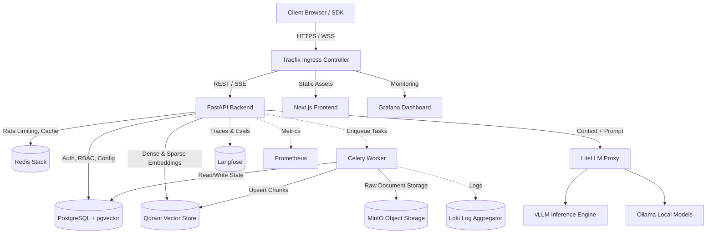
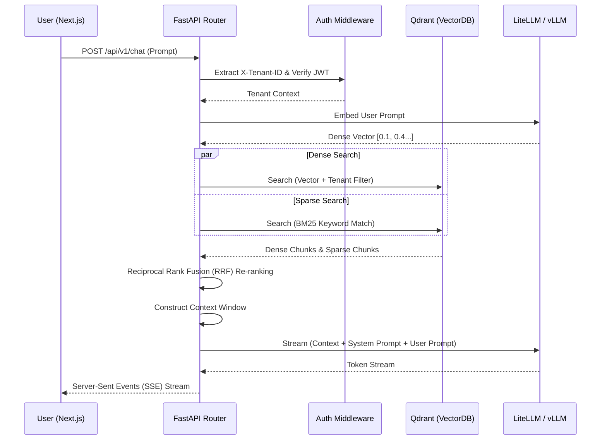
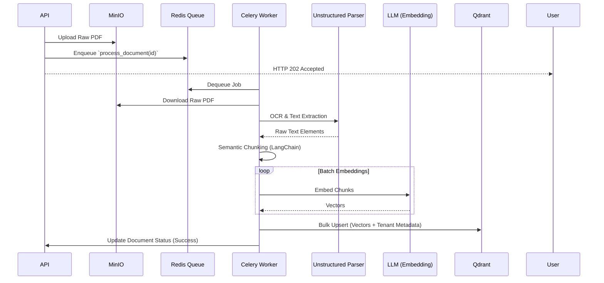

# Architecture: Enterprise RAG AI Platform

## 1. High-Level System Architecture

The platform operates as a modular, horizontally scalable microservices ecosystem. It is engineered for true logical multi-tenancy, ensuring data isolation across the entire stack.

## 2. Hybrid RAG Query Flow

Our Retrieval-Augmented Generation pipeline leverages both semantic (Dense) and keyword (Sparse BM25) search for maximum recall.

## 3. Asynchronous Ingestion Pipeline

Document ingestion is fully decoupled from the API to prevent blocking operations when handling large PDFs or multi-gigabyte archives.

## 4. Security & Tenant Isolation Model

Security is built into the lowest levels of the architecture. The platform operates on a **Logical Separation** model.

### 4.1 Request Context
Every request passing through Traefik is intercepted by `TenantMiddleware` in FastAPI. This middleware extracts the `X-Tenant-ID` (or infers it from the subdomain) and binds it to a `ContextVar`. Every subsequent database or cache operation is inherently filtered by this context.

### 4.2 Row-Level Security (PostgreSQL)
PostgreSQL schemas leverage SQLAlchemy global filters to ensure a query for `Document.select()` implicitly appends `WHERE tenant_id = current_tenant`.

### 4.3 Vector Isolation (Qdrant)
Qdrant does not support true database-level multi-tenancy in the open-source version. To compensate, all vector upserts and search payloads strictly inject `{ "tenant_id": "uuid" }` into the Qdrant `payload`. The search wrapper enforces a mandatory `Must` filter condition on this key, guaranteeing tenant isolation at the index level.

### 4.4 Air-gapped AI
By utilizing local models via `vLLM` and `Ollama`, no prompts or retrieved context ever leave the VPC. The `LiteLLM` proxy acts as an internal firewall, capable of masking PII before sending it to the model layer (if configured).
